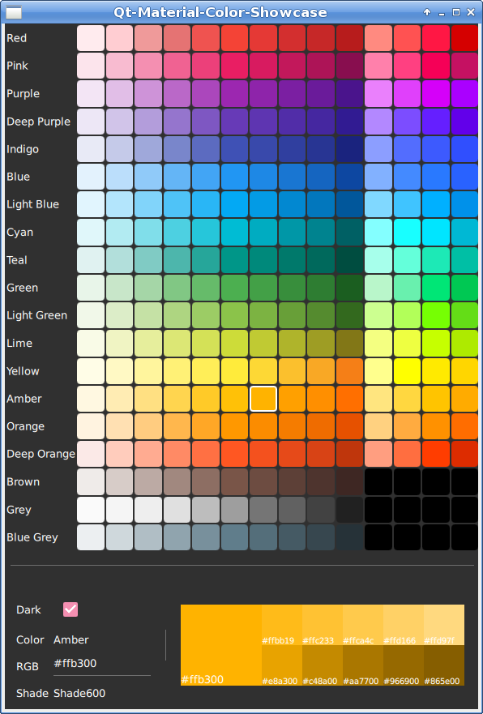

# Qt-Material-Color-Showcase
Showcase for Qt material color palette

# Color Palette

Color palette is generate by using 
- `Qt.lighter()` with an increase step of `0.1` for lighter colors
- `Qt.darker()` with an increase step of `0.2`for darker colors

Keep in mind that with the functions provided by Qt is not possible to obtain the same palette as [Material Color Tool](https://material.io/resources/color).
